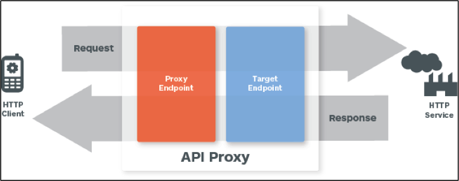
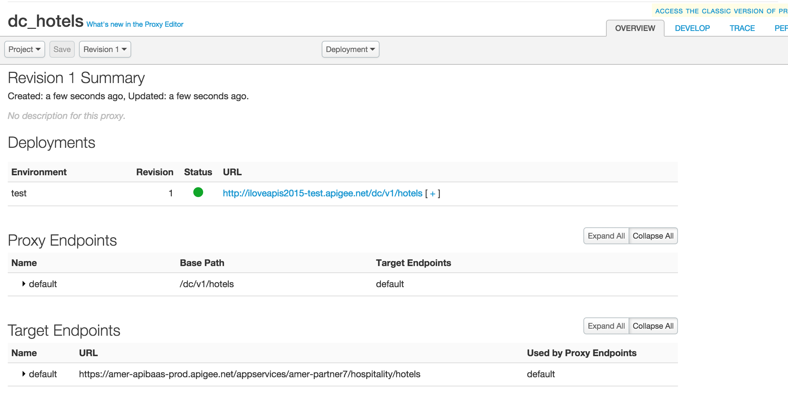
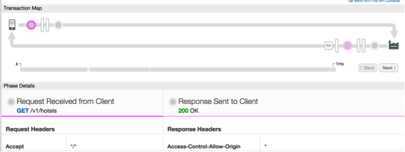

#API Services: Lesson 2 - Passthrough Facade

##Overview
Apigee Edge enables you to expose APIs that can be easily consumed by developers who build apps. You expose APIs on Apigee Edge by building API proxies that act as managed 'facades' for backend services. 
You expose APIs on Apigee Edge by implementing API proxies. An API proxy is a bundle of XML configuration files and code (such as JavaScript and Java) that implements the facade for your backend HTTP services. API proxies decouple the developer-facing API from your backend services, shielding developers from code changes and enabling you to innovate at the edge without impacting internal applications and development teams. As development teams make backend changes, developers continue to call the same API without any interruption.
API proxies manage request and response messages using a 'pipeline' processing model that defines 'Flows'. To customize the behavior of your API, you attach Policies to request and response Flows. 
In an API proxy configuration, there are two types of endpoints: 
* **ProxyEndpoint:** This configuration manages interactions with apps that consume your API. You configure the ProxyEndpoint to define the URL of your API. You usually attach Policies to the ProxyEndpoint to enforce security, quota checks, and other types of access control and rate-limiting.
* **TargetEndpoint:** This configuration manages interactions with your backend services on behalf of consumer apps. You configure the TargetEndpoint to forward request messages to the proper backend service. You usually attach Policies to the TargetEndpoint to ensure that response messages are properly formatted for the app that made the initial request.
You can visualize API proxies as shown by the graphic below. A basic request and response exchange between an app (HTTP client) and a backend service is managed in an API proxy by a ProxyEndpoint and TargetEndpoint. 

You can build API proxies using the Apigee Edge management UI. You can also implement API proxies on your local machine, and then import them to your organization on Apigee Edge. For an overview of the UI and API, see [Using the Apigee Edge development environment](http://apigee.com/docs/api-services/content/using-apigee-edge-development-environment).

##Objectives
In this lab you will get familiar with the Apigee Edge Management UI by creating a simple passthrough facade to the GET API for the `hotels` data collection in API BaaS. After creating the facade you will also learn how to deploy and undeploy a proxy. Finally you will also learn how to use the Trace capabilities in the Management UI.

##Prerequisites
- [x] API Services - Lesson 1 completed
- [x] Postman tool installed with `SE Technical Environment` environment configured and `SE Technical Environment` bundle imported.

##Estimated Time: 15 mins

1. Creating an API Proxy for a backend service that you want to expose requires you to provide the network address for the backend service, along with some information that API Services uses to model the API that will be exposed to developers.
 1. Open up a browser tab and log in to http://edge.apigee.com
 2. From the `Organization` drop-down in the top-right corner, select the organization assigned to you
 3. From the `Environment` drop-down, select `test`
 4. From the main menu, select APIs → API Proxies
    
 5. To create a new API proxy, select the `+ API Proxy` button to add a new proxy.
 	
 6. On the `New API Proxy` form that is displayed, provide information needed to generate an API proxy
 	
```
	Starting Point Type: Backend Service
	Backend Service URL: https://amer-apibaas-prod.apigee.net/appservices/{your-org}/hospitality/hotels
	Name: hotels
	Project Base Path: /v1/hotels
	Description: Facade to the BaaS hotels data collection
	Features: None
```
 7. Click on `Build` to build and deploy the proxy
 8. Once the proxy has been deployed, click on the `Close` button
 9. Review the information on the resulting API Proxy page
 	
 10. That’s it! With those few steps, you’ve deployed a simple passthrough API Proxy which acts as a facade to our BaaS `hotels` data collection
2. **Deploying & Undeploying a Proxy** to a given environment from the Management UI is simple too.
 1. Click on the `Deploy` drop-down on the API Proxy page
 	
 2. Notice that the proxy we just created is deployed to the `test` environment
 3. Click on the `test` environment name. This undeploys the proxy from the `test` environment
 4. Click on the `Deploy` drop-down again and select the `test` environment. This re-deploys the proxy to the `test` environment
3. Tracing the execution of a proxy can also be done easily from the Management UI. This is a very powerful capability of the product since it makes it easy to troubleshoot and monitor API proxies running on Apigee Edge. Trace lets you probe the details of each step through an API proxy flow. 
 1. From the `hotels` API Proxy page, click on the `Trace` tab
 	
 2. Once on the `Trace` tab, pick the correct environment from the ‘Deployment to Trace’ drop-down. In your case there should only be one environment to pick - `Environment test, Revision 1`
 	
 3. Click on the `Start Trace Session` button
 4. After the trace session starts, click on the `Send` button in the `Send Requests` section
 	
 5. You will see the a transaction appear in the `Transactions` section and a visual representation of the executed proxy flow in the `Transaction Map` section
 6. The `Transaction Map` is interactive - click on the various execution steps within the flow and review the information provided in the `Phase Details` section. You will notice that for each step information such as headers, variables, payload, properties and other relevant information is available. This helps you quickly understand exactly what is happening within the proxy flow.
 	
 7.At this point, we will start to use the `Postman` tool as a client to invoke our proxy and continue to use `Postman` throughout the rest of the labs. 
    - Launch `Postman`
    - Select the `SE Technical Enablement` environment
   	
    - Open the `SE Technical Enablement` project
    - Select and send the `/GET hotels` request
   	
    - Review the response returned by the proxy. It should be the same response as the one you observed when using the `Trace` tool in the Management UI

 8. Switch to the ‘Trace’ tab of the Apigee Edge Management UI and click on the ‘Stop Trace’ button

##Summary
That completes this hands-on lesson. Simple and quick, but you learned the fundamentals of how to create an API Proxy, how to deploy and undeploy it to/from an environment, and how to trace the proxy flow. Throughout the rest of the hands-on labs you will be working with this Management UI to add policies to proxies, testing and tracing these proxies, and learning about the power of the Apigee Edge platform.


