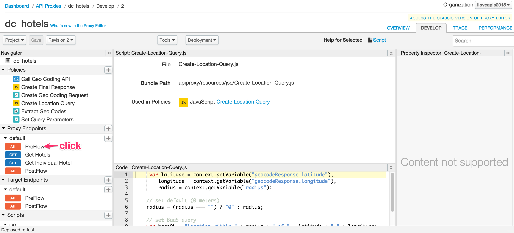
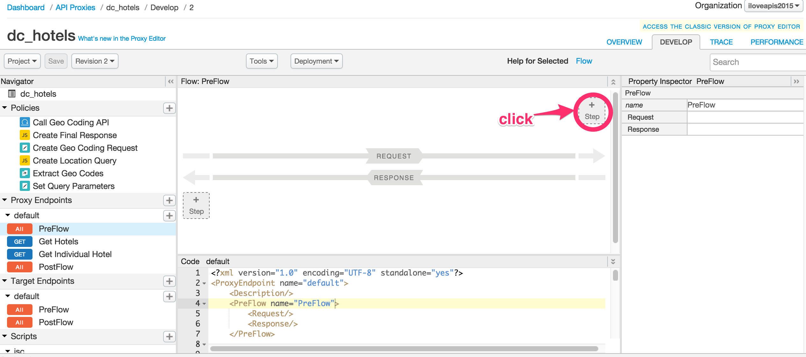
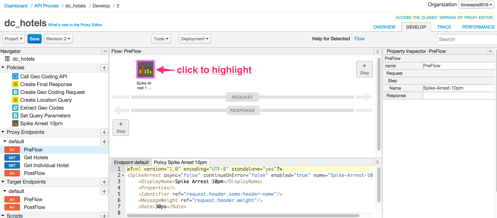

# API Services: Lesson 4 - Add Traffic Management Policies

## Overview
To maintain performance and availability across a diverse base of client apps, it's critical to maintain app traffic within the limits of the capacity of your APIs and backend services. It's also important to ensure that apps don't consume more resources than permitted.

Apigee Edge provides three mechanisms that enable you to optimize traffic management to minimize latency for apps while maintaining the health of backend services. Each policy type addresses a distinct aspect of traffic management. In some cases, you might use all three policy types in a single API proxy.

### Spike Arrest Policy
This policy smooths traffic spikes by dividing a limit that you define into smaller intervals. For example, if you define a limit of 100 messages per second, the Spike Arrest policy enforces a limit of about 1 request every 10 milliseconds (1000 / 100); and 30 messages per minute is smoothed into about 1 request every 2 seconds (60 / 30). The Spike Arrest limit should be close to capacity calculated for either your backend service or the API proxy itself. The limit should also be configured for shorter time intervals, such as seconds or minutes. This policy should be used to prevent sudden traffic bursts caused by malicious attackers attempting to disrupt a service using a denial-of-service (DOS) attack or by buggy client applications.
See [Spike Arrest policy](http://apigee.com/docs/ja/api-services/reference/spike-arrest-policy).

### Quota Policy
This policy enforces consumption limits on client apps by maintaining a distributed 'counter' that tallies incoming requests. The counter can tally API calls for any identifiable entity, including apps, developers, API keys, access tokens, and so on. Usually, API keys are used to identify client apps. This policy is computationally expensive so, for high-traffic APIs, it should configured for longer time intervals, such as a day or month. This policy should be used to enforce business contracts or SLAs with developers and partners, rather than for operational traffic management.
See [Quota policy](http://apigee.com/docs/ja/api-services/reference/quota-policy).

### Concurrent Rate Limit Policy
This policy enables traffic management between API Services and your backend services. Some backend services, such as legacy applications, may have strict limits on the number of simultaneous connections they can support. This Policy enforces a limit on the number of requests that can be sent at any given time from API services to your backend service. This number is counted across all of the distributed instances of API Services that may be calling your backend service. Policy limits and time duration should be configured to match the capacity available for your backend service.
See [Concurrent Rate Limit policy](http://apigee.com/docs/ja/node/11646).

### Caching Policies
Apigee Edge supports different caching policies enabling you to:
- **Reduce latency:** A request satisfied from the cache gets the representation and displays it in a shorter time. The server is more responsive with requests satisfied from the cache, which is closer to the client than the origin server.
- **Reduce network traffic:** Representations are reused, reducing the impact of processing duplicate or redundant requests. Using a cache also reduces the amount of bandwidth you use.
- **Persist data across transactions:** You can store session data for reuse across HTTP transactions.
- **Support security:** You may need "scope" access to the contents of a cache so it can only be accessed in a particular environment or by a specific API proxy.

The various caching policies supported by Apigee Edge are:

- **Response Cache:** - This policy allows API designers to store the full response data received from a backend resource in a cache, and then serve responses directly from that cache. This reduces the number of requests sent to the backend resource, and reduces latency.   
See [Response Cache policy](http://apigee.com/docs/api-services/reference/response-cache-policy).

- **Populate Cache:** - Use the PopulateCache policy to write arbitrary data to the cache. While the ResponseCache writes and reads full responses, PopulateCache is more like a lower-level primitive that can store context variables in cache based on a composite key.   
See [Populate Cache policy](http://apigee.com/docs/api-services/reference/populate-cache-policy).

- **Lookup Cache:** - This policy is the companion to the `PopulateCache`; use this one when you want to retrieve arbitrary cached values.   
See [LookupCache policy](http://apigee.com/docs/api-services/reference/lookup-cache-policy).

- **Invalidate Cache:** - Use this policy when you need to explicitly clear a cache during request processing. One example: a user requests a logout, and the API proxy clears all cached data being held for that user.   
See [Invalidate Cache policy](http://apigee.com/docs/api-services/reference/invalidate-cache-policy).

## Objectives

The goal of this lesson is to introduce you to Traffic Management policies and applying a couple of these policies to the ‘{your-initials}_hotels’ API Proxy you created in the previous lesson.

## Pre-Requisites
- [x] API Services - Lesson 3 completed

## Estimated Time: 30 mins

### Adding a Spike Arrest Policy
- Go to the Apigee Edge Management UI browser tab

- Insure you have selected APIs → API Proxies  → the `{your-initials}_hotels` proxy.

- click the `Develop` tab

- in the left-hand-side navigator, in the Proxy Endpoints section, under the default proxy, highlight the Pre-Flow. 
  

- In the center canvas, click the "+ Step" in the request flow. 
  

- In the resulting dialog, scroll and select the `Spike Arrest` policy. Specify the following values:
 - Display Name: **Spike Arrest 10pm**
 - Name: **Spike-Arrest-10pm**

  **Note:** Because you added the policy to the Pre-Flow, this Spike Arrest policy will get enforced for all the Flows defined for this Proxy.

- Notice that an icon for the **Spike Arrest 10pm** policy appears in the canvas. Click it. 
  

- Now, in the XML editor pane below the center canvas, copy-paste the following: 
  ```xml
  <SpikeArrest name="Spike-Arrest-10pm">
    <DisplayName>Spike Arrest 10pm</DisplayName>
    <Rate>10pm</Rate>
  </SpikeArrest>
  ```

- Save the changes to the proxy and ensure that it is deployed successfully to the `test` environment


Think of Spike Arrest as a way to generally protect against traffic spikes rather than as a way to limit traffic to a specific number of requests. Your APIs and backend can handle a certain amount of traffic, and the Spike Arrest policy helps you smooth traffic to the general amounts you want.

The runtime Spike Arrest behavior differs from what you might expect to see from the literal per-minute or per-second values you enter.

For example, say you enter a rate of 30pm (30 requests per minute). In testing, you might think you could send 30 requests in 1 second, as long as they came within a minute. But that's not how the policy enforces the setting. If you think about it, 30 requests inside a 1-second period could be considered a mini spike in some environments.

What actually happens, then? To prevent spike-like behavior, Spike Arrest smooths the allowed traffic by dividing your settings into smaller intervals:

  - **Per-minute** rates get smoothed into requests allowed intervals of **seconds**. For example, 30pm gets smoothed like this: 60 seconds (1 minute) / 30pm = 2-second intervals, or about 1 request allowed every 2 seconds. A second request inside of 2 seconds will fail. Also, a 31st request within a minute will fail.

  - **Per-second** rates get smoothed into requests allowed in intervals of **milliseconds**.For example, 10ps gets smoothed like this: 1000 milliseconds (1 second) / 10ps = 100-millisecond intervals, or about 1 request allowed every 100 milliseconds . A second request inside of 100ms will fail. Also, an 11th request within a second will fail.

### Testing the Spike Arrest Policy

- Use Postman to quickly send more than 10 requests in succession. Observe that certain requests will receive an error with the errorCode `policies.ratelimit.SpikeArrestViolation`. 


### Adding a Response Cache Policy

Now we will add a ResponseCache policy to reduce external service calls, reduce network traffic and improve performance.

- Back in the Apigee Edge browser tab

- Click the "+ Step" button

- in the "Add Step" dialog, scroll and select the "Response Cache" policy.  Specify these values:  
  - Display Name: **Cache Hotels Data**
  - Name: **Cache-Hotels-Data**
  - Target Endpoint: **Target Endpoint default**

- Click "Add"

  Once the `Cache Hotels Data` policy appears in the canvas, click it to review its properties. Since everything else except the name was left as a default, you will notice that the Expiration Timeout in Seconds is set to 3600, or 60 minutes. The timeout property along with other properties should be modified as per your use cases. For policy reference information, see [Response Cache policy](http://apigee.com/docs/api-services/reference/response-cache-policy). 

  The Response Cache policy needs a Cache Resource that can be used to cache the data. Apigee Edge provides a default cache resource that can be used for quick testing, which is what is being used in this lesson. The Cache Resource to be used by Response Cache policies should also be created and configured as per your use cases. For Cache Resource configuration information, see [Manage Caches for an Environment](http://apigee.com/docs/api-services/content/manage-caches-environment). 

- Save the changes to the API Proxy, wait for it to successfully deploy

### Testing the Response Cache Policy

- click the Trace Tab

- Start the API Trace 

- switch to Postman. 

- from within Postman, send a test `/GET hotels` request from `Postman` with the following query parameters: `zipcode=98101&radius=200`

- Wait for about 10 seconds, to avoid the Spike Arrest policy from stopping your requests, and send the same request again from `Postman`. 

- Go back to the Trace view and review the transaction map of both the requests including the overall elapsed time to process both requests.  

- You should observe that the first request took substantially longer than the second request. 

  
 
- click the first transaction. The transaction map should look as follows:

  

  This depiction indicates that the full logic of the API Proxy was executed. Specifically, the cache check resulted in a miss, and then the requests were sent out. The backend response got inserted into cache. The results were combined, and then finally sent to the originall client. The Trace tool is a key differentiator for Apigee Edge! 
 
- click the second transaction. The transaction map should look as follows:

   

  This indicates that there was a cache hit, and the backend request was retrieved from cache. 


After configuring the Response Cache policy, as expected, after the initial request, the second and all other requests for the next N seconds will be served from the cache and hence avoid executing any other policies. Since the service callout, target service and other transformation policies are not executed, the overall transaction time has also dropped significantly. 

## Summary
That completes this hands-on lesson. You learned how to use the Spike Arrest to protect the environment from traffic spikes and to use the Response Cache policy to provide a better overall experience for the API consumer while reducing network traffic. Obviously like any other policy, these policies must be used appropriately based upon your use cases.


