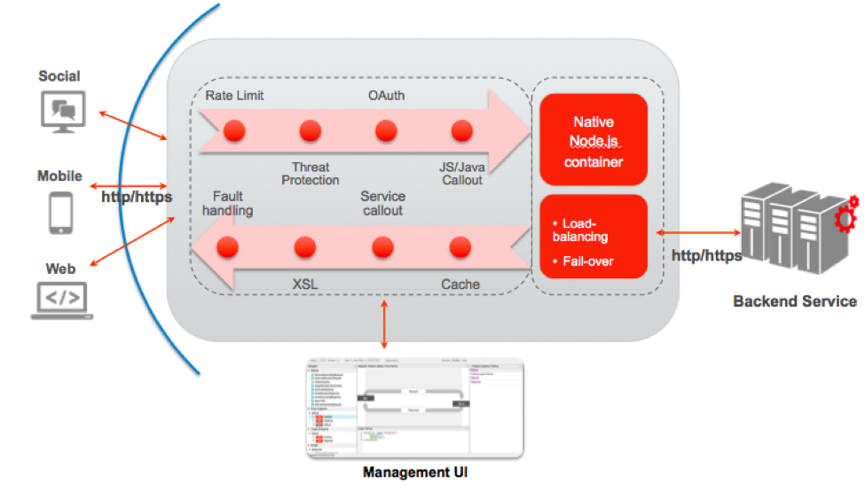
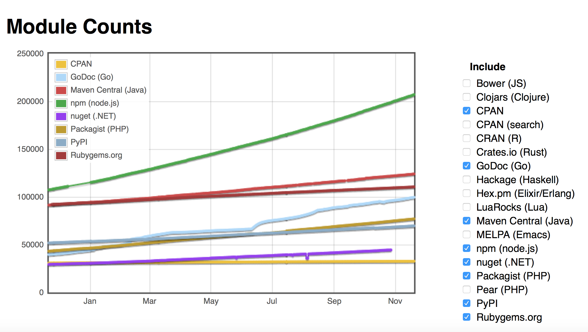

#API Services: Lesson 6 - Create a Node.js Proxy

## Overview
Node.js on Apigee Edge adds more programmability to the Edge API platform. Running on Edge, Node.js apps take advantage of Edge's enterprise-grade cloud operations like traffic management, security, deployment tools, revision control, logging, and analytics. Furthermore, you can leverage thousands of third-party Node.js modules in your APIs.


 
Enterprise developers have found many creative ways to integrate Node.js applications into the Edge platform. Some common use cases include:
- Build highly customized **standalone APIs** and **backend services**.
- Build **backend logic for API BaaS** to leverage cloud data storage and management, user management, push notifications, and more.
- Solve complex **orchestration** and **mobile optimization** problems using Apigee policies with the advantage of a scriptable target endpoint.
- Build **composite services** and **mashups**.
- Rapidly develop prototypes of new APIs using frameworks like [Express](http://expressjs.com/), [Argo](http://expressjs.com/), and [Usergrid](https://npmjs.org/package/usergrid).

## Why Node.js? 

Node.js is *rapidly* growing in popularity, as this Google trends chart shows:

 

Also, nodejs is rapidly growing in power, as this chart from [modulecounts.com](http://modulecounts.com) shows:

 

Also, node performs well, and is being actively maintained. For all these reasons, including node.js into Apigee Edge makes a lot of sense. We think the ability to host nodejs applications in the platform, right next to the API Management capability, is a clear differentiator for Apigee Edge. 

## Objectives
The goal of this lesson is to introduce you to Node.js, download and use Node.js modules from NPM, create a simple API using Node.js and deploy the API to your Apigee Edge environment using Apigee’s deployment tool.


## Prerequisites
- [x] Your Apigee Edge organization name, user name, and the password 
- [x] Node downloaded from http://nodejs.org/download/ and installed as an admin user
- [x] apigeetool NPM module downloaded and installed globally as an admin user. 
  ```sh
  sudo npm install -g apigeetool
  ```
- [x] An understanding of Node.js and Javascript

## Estimated Time: 45 mins

- Open up a terminal window
- In your home directory, create a new directory structure as follows: `apigee/node-api/weather`
- Go to the `apigee/node-api/weather` directory that you just created
- Using your favorite code editor (if you don't have one, try [Visual Studio Code](https://code.visualstudio.com/) (free) or [Sublime](http://www.sublimetext.com/) (pay) or TextWrangler), create a new file in the `apigee/node-api/weather` directory with the following Javascript code in it and save it as `weather.js`. 
  ```node
  var express  = require('express'),
      YQL      = require('yql'),
      re1      = new RegExp('[0-9]{5}'),
      app      = express();

  // Generic Send Error Function
  function sendError(res, code, msg) {
    res.status(code);
    res.json({ error: msg });
  }

  // GET /forecast
  app.get('/forecast', function(request, response) {
    try {
      // is the zipcode parameter present and valid?
      if (!request.query.zipcode || !request.query.zipcode.match(re1)) {
        sendError(response, 400, 'Missing or invalid query parameter - zipcode');
      }
      else {
        // Create the query according to YQL requirements.
        // No need to further sanitize the query param, because of regex check above.
        var forecastQuery =
           'SELECT * FROM weather.forecast WHERE woeid IN (SELECT woeid FROM geo.places(1) WHERE text="'+
           request.query.zipcode +'")';

        var query = new YQL(forecastQuery);
        // execute the query and then asynchronously create/send the
        // response in the anonymous callback function.
        query.exec(function(error, data) {
          if (error) {
            sendError(response, 500, error);
          }
          else {
            response.json({
              location : data.query.results.channel.location,
              units : data.query.results.channel.units,
              condition : data.query.results.channel.item.condition,
              forecast : data.query.results.channel.item.forecast
            });
          }
        });
      }
    }
    catch(e) {
      sendError(response, 500, "Internal Server Error - " + e.message);
    }
  });

  // catch and return 404
  app.use(function(req, res, next) {
    res.status(404);
    res.json({ message: "Not found" });
  });

  // start the server
  var listener = app.listen(process.env.PORT || 7000, function() {
        var host = listener.address().address;
        var port = listener.address().port;
        console.log('server listening at http://%s:%s', host, port);
      });
  ```

- The above code is fairly self explanatory, but below is a brief explanation:

  The first few lines declare Node modules - `express` and `yql` - that the rest of code will utilize. 

  **Express** is a minimal and flexible Node.js web application framework that provides a robust set of features for web and mobile applications. 

  **yql** (Yahoo! Query Language) is a module from Yahoo that can be used to to query, filter, and combine data across the web through a single interface. It exposes a SQL-like syntax for getting the right data.

  The code then uses the express framework to handle `HTTP GET` requests for one resource: `/forecast`.

  In the implementation for the `GET /forecast` resource, if the `zipcode` parameter is present and valid, then it sends a yql query to retrieve the weather for that zipcode.

  The callback processes the response from the yql call. This callback function sends back to the original API caller just a relevant subset of the full yql response. 

  All of the HTTP requests get processed by the HTTP server that is started on port 7000 with the `app.listen(portNumber)` code.

- `npm` is a command-line tool that helps you manage node packages. For example the `npm install` command will download the named package and make it available in the `node_modules` subdirectory of your current directory. Any nodejs app you write will look in `node_modules` at runtime and will be able to find and use the modules you've installed.  
  `npm` also performs other tasks.  One of them is, initializing a nodejs application directory.  Somewhat analogous to `git init`, `npm init` will prepare a directory to contain a node.js application.   
  Back in your terminal window, be sure to cd to the `apigee/node-api/weather` directory. Then, perform the following tasks:

  1. initialize the directory:

    ```sh 
    npm init
    ```
    This first command will run an interactive session. Provide the following values during the interactive npm init session to create a package.json file for the Node module that you will be deploying to Apigee Edge:

    - name: weather
    - version: 1.0.0
    - description: Apigee API facade to a Yahoo weather service
    - entry point: weather.js
    - test command: 
    - git repository: 
    - keywords:
    - author: YOUR-NAME
    - license: MIT

  2. install the express module

    ```sh
    npm install express@4.13.3 --save
    ```
    The prior command downloads the `express` module at the specified version, and updates the dependencies list in the `package.json` file.

  3. install the yql module

    ```sh
    npm install yql@1.0.2 --save
    ```

    This command downloads Yahoo’s `yql` module locally and updates the dependencies list in the `package.json` file.

  4. check the package.json file: 

    ``` 
    cat package.json
    ```
    Observe that the package.json file has been created, and includes a list of dependencies. The directory is now ready for running a nodejs app that uses those modules.  You could have created this file manually, with those module names and version numbers , and then run `npm install` to get the same results. 

- To test the weather API locally:

  - start the `weather.js` module from the command line as follows: 
    ```sh
    node weather.js
    ```
    The server should start within a few seconds with a message `The server is running!` on the console.

  - Go to the Postman tool and run the ‘/GET forecast - localhost’ request.  Alternatively, you can invoke the command from another terminal window, with something like this: 
    ```
    curl -i http://localhost:7000/forecast?zipcode=95113
    ```

  - If everything is working correctly, you should see a response similar to the following: 

    ```json

  {
    "location": {
      "city": "Louisville",
      "region": " CO",
      "country": "United States"
    },
    "units": {
      "distance": "mi",
      "speed": "mph",
      "temperature": "F",
      "pressure": "in"
    },
    "condition": {
      "date": "Wed, 01 Jun 2016 09:00 AM MDT",
      "text": "Partly Cloudy",
      "code": "30",
      "temp": "54"
    },
    "forecast": [
      {
        "code": "47",
        "text": "Scattered Thunderstorms",
        "high": "65",
        "low": "48",
        "date": "01 Jun 2016",
        "day": "Wed"
      },
      {
        "code": "34",
        "text": "Mostly Sunny",
        "high": "76",
        "low": "51",
        "date": "02 Jun 2016",
        "day": "Thu"
      },
             . . .
      ]
    }
    ```

  - This completes the test. Stop the locally running node process by pressing `ctrl-c` in the appropriate terminal window.

- To deploy the weather API to Apigee Edge you will use the `apigeetool`. 

  As mentioned in the Overview section, running on Edge, Node.js apps take advantage of Edge's enterprise-grade cloud operations like traffic management, security, deployment tools, revision control, logging, and analytics. You can deploy an existing Node.js API application, including any dependent Node.js modules, from your local system to Apigee Edge using a command-line utility called `apigeetool`. The utility automatically bundles the application and its dependencies into an API proxy and deploys it on Edge. To deploy the weather API to Apigee Edge:

  - In the terminal, ensure that you are in the `apigee/node-api/weather` directory
  - Run the following command:
    ```sh
    apigeetool deploynodeapp -n {your-initials}_weather -d . -m weather.js -o YOUR-ORG -e test -b /{your-initials}/v1/weather
    ```

    ***Note:*** Replace `YOUR-ORG` in the above command with the actual name of your Apigee Edge organization.

    Provide the Apigee Edge Org. Admin username and password when prompted.

  - Wait for the `apigeetool` to deploy the API to Apigee Edge. `apigeetool` uses the administrative APIs exposed by Apigee Edge to import and then deploy the API proxy for this nodejs server. 

    If the API is deployed successfully, you should see a message similar to the following:

      ```
      "weather" Revision 1
        deployed
        environment = test
        base path = /
        URI = http://ORGNAME-ENVNAME.apigee.net/{your-initials}/v1/weather
      ```

- Go to the Postman tool and run the `/GET forecast - Apigee Edge` request. If everything is working correctly, you should see a response similar to the one received from weather API running on your localhost.


## Extra Credit

Feel free to experiment with the nodejs logic. You can require other npm packages, modify the code, introduce other endpoints. Hosting nodejs logic inside Apigee Edge is a very powerful feature, and a clear differentiator for Apigee. 

## Summary
That completes this hands-on lesson. In this lesson you learned how to use Node and some of the available modules to create your API, run and test the API from your localhost and use Apigee’s apigeetool to deploy the API written in Node to Apigee Edge.
