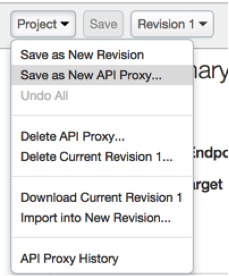
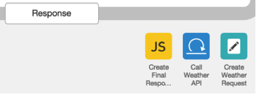

# API Services: Lesson 7 - Create an API Mashup

## Overview

Apigee enables you to quickly combine results from multiple APIs to create innovative ‘mashup’ APIs. By mashing up APIs on the server (i.e. in Apigee Edge), you create more optimized and easy-to-consume APIs that reduces the amount of work that app developers have to do in creating rich apps. Ultimately this increase developer productivity and reduces time to market - both of which are beneficial to the business. Several such examples of mashups exist today:

- [Trulia’s use of the Google Maps APIs](http://googleforwork.blogspot.com/2013/05/google-maps-helps-trulia-put-some-heart.html) to create a mashup of real estate information with interactive maps
- [Voxy’s use of AT&T Speech-to-Text APIs](http://developer.att.com/success-stories/voxy) for a language-learning App
- Many different travel-oriented sites mashup weather, hotel, flight, car rental and other APIs from different API providers creating rich user experiences
- Amazon’s Product Advertising APIs used by affiliates in their applications to earn affiliate revenue
API mashups are at the heart of creating consumable APIs. These ‘mashed-up’ APIs provide an overall utility and value-add that is greater than the individual APIs. Apigee Edge enables developers to create API mashups easily using a variety of policies. 

## Objectives
You have already seen an example in [Lab 3](../API%20Services%20Lesson%203%20-%20Adding%20Resources%20and%20Policies) where a `Service Callout policy` was used to convert a zip code to geolocation coordinates. That is, in-a-way, an example of a mashup even though the response from that API was not directly used to create the final response sent to the API consumer. The objective of this lesson is create a new proxy (`{your-initials}_hotelspro`) that mashups the hotel data with weather data before sending the response to the API consumer.

To keep things simple for this lesson, you will create a copy of the `hotels` proxy to create a `{your-initials}_hotelspro` proxy. You will then modify the `{your-initials}_hotelspro` proxy to add the weather data mashup, create a new API Product (`Hospitality Pro Product`) that bundles the `{your-initials}_hotelspro` proxy, and then create a new Developer App (`iExplore Pro App`) that has access to the `Hospitality Pro Product`.

## Prerequisites
- [x] API Services - Lesson 5 & 6 completed 

## Estimated Time: 30 mins

### Creating the ‘Pro’ Mashup Proxy

- From the Apigee Edge Management UI, go to `APIs` → `API Proxies` → `hotels proxy`
- From the `Project` drop-down, select the `Save as new API Proxy...` option



- In the `Save as new API Proxy` dialog, specify the `API Proxy Name` as `{your-initials}_hotelspro` and click `Add`
- You will be taken to the `Overview` tab of the `hotelspro` proxy. Click on the `Edit Revision Summary` button and change the revision properties as follows:
  - Description: **Facade to the BaaS hotels data with weather mashup**
  - Default Proxy Endpoint Base Path: **/{your-initials}/v1/hotelspro**

- Click on the `Accept` button for the revision property changes to be accepted
- Go to the `Develop` tab of the `{your-initials}_hotelspro` proxy
- From the `New Policy` drop-down, select the `Assign Message` policy
- In the `New Policy - Assign Message` dialog box provide the following information:
  - Policy Display Name: **Create Weather Request**
  - Policy Name: **Create-Weather-Request**
  - Attach Policy: **Checked**
  - Flow: **Flow Get Hotels, Proxy Endpoint default**
  - Segment: **Response**

- Drag-and-drop the `Create Weather Response` policy so that it is to the right of the `Create Final Response` policy

 

- Modify the XML configuration of the `Create Weather Request` as follows:

```xml
<AssignMessage name="Create-Weather-Request">
  <DisplayName>Create Weather Request</DisplayName>
  <AssignTo createNew="true" type="request">WeatherRequest</AssignTo>
        <Set>
        <QueryParams>
              <QueryParam name="zipcode">{zipcode}</QueryParam>
        </QueryParams>
        <Verb>GET</Verb>
        </Set>
</AssignMessage>
```

Here you are preparing the Request message with the `zipcode` query parameter. Note that the value of the `zipcode` query parameter is being set using the `{zipcode}` variable, which was saved as a flow variable on the Request side in an earlier lesson.
This request is being prepared for the next step where a Service Callout policy will be used to call the Node.js `weather` proxy created in an earlier lesson. 
- Add a `Service Callout` policy with the following properties:
 - Policy Display Name: **Call Weather API**
 - Policy Name: **Call-Weather-API**
 - Attach Policy: **Checked**
 - Flow: **Flow Get Hotels, Proxy Endpoint default**
 - Segment: **Response**

- Drag-and-drop the ‘Call Weather API’ policy so that it is to the right of the ‘Create Final Response’ policy

 

- Modify the XML configuration of the `Call Weather API` policy as follows:

```xml
<ServiceCallout name="Call-Weather-API">
    <DisplayName>Call Weather API</DisplayName>
    <Request clearPayload="true" variable="WeatherRequest">
    </Request>
    <Response>WeatherResponse</Response>
    <HTTPTargetConnection>
        <Properties/>
      <URL>http://{your-org}-test.apigee.net/{your-initials}/v1/weather/forecast</URL>
    </HTTPTargetConnection>
</ServiceCallout>
```

**Note:** Replace `{your-org}` with the actual name of your Apigee Edge organization.

- Modify the Javascript code in the `Create-Final-Response.js` file.  Look in the file for this comment line, on or around line 12: 
  ```
  // add the hotels response
  ```

  Add the following few lines of code right *before* this line:
  ```javascript
  // get the weather response received from the service callout
  var weatherResponse = context.getVariable("WeatherResponse.content");
  finalResponse.weather = (weatherResponse !== null) ? 
    JSON.parse(weatherResponse) : {} ;
  ```

  The above lines of Javascript mashes-up the Weather information with the Hotel information in the final response that is being sent to the API consumer. 

- Click on the `Save` button to save the changes made to the `{your-initials}_hotelspro` proxy 

- Click on the `Deployment` drop down and select `test` to deploy the `{your-initials}_hotelspro` proxy to the test environment.

### Creating the `Pro` API Product

- From the Apigee Edge Management UI, go to `Publish` → `Products`
- Add a new API Product with the following Product Details & Resources:

Product Details
 - Display Name: **Hospitality Pro Product**
 - Description: **API Bundle for a Pro Hospitality App.**
 - Environment: **Test**
 - Access: **Public**
 - Key Approval Type: **Automatic**

Resources 
 - Paths: **/ & /****
 - Revision: **1**
 - API Proxy: **{your-initials}_hotelspro**


###Creating the “iExplore Pro App”  Developer App 
- From the Apigee Edge Management UI go to `Publish`->`Developer Apps`
- Add a new Developer Apps with following app details:
 - Name : **iExplore Pro App**
 - Display Name: **iExplore Pro App** 
 - Developer: Select a developer from Dropdown. In case no developer is present , create a new Internal developer from **Publish->Developers**
 - Callback Url: 
 - Notes: 
 - Products : Click the +Product to add a product. Select **Hospitality Pro** Product from drop down and then click symbol `√` . Save the developer App.


###Testing the ‘{your-initials}_hotelspro’ Proxy

- Using Postman, obtain the access_token using the Consumer Key and Consumer Secret of the iExplore Pro App. If you do not have the Postman collection, you can use curl, like so: 
  ```
curl -X POST -i \ 
  https://ORGNAME-ENVNAME.apigee.net/oauth2/token?grant_type=client_credentials \
  -d 'client_id=CLIENT_ID_HERE&client_secret=CLIENT_SECRET_HERE'
  ```

  Remember to replace CLIENT_ID_HERE and CLIENT_SECRET_HERE with appropriate values. 

  The response payload should look like: 
  ```json
  {
    "issued_at" : "1447890042513",
    "application_name" : "e1c3cb15-fcc2-4eae-8d1c-4b1e5f1f361e",
    "scope" : "",
    "status" : "approved",
    "api_product_list" : "[Hospitality Pro Product]",
    "expires_in" : "3599",
    "developer.email" : "irajeevsingh+mpolo@gmail.com",
    "token_type" : "BearerToken",
    "client_id" : "A8AD5EBfy8nQTHnr2P7YEZFZAlAtKNnx",
    "access_token" : "fTEcxchwgHp3se8YBf0xFAjSffP4",
    "organization_name" : "amer-partner7",
    "refresh_token_expires_in" : "0",
    "refresh_count" : "0"
  }
  ```

  You want to copy the access_token from that payload. 

- Start a Trace session for the `{your-initials}_hotelspro` proxy
- Set up the `/GET hotelspro` request in Postman with the following query parameters and header: 

  - Query Parameters:
    - zipcode: **98101**
    - radius: **200**
  - Header:
    - Authorization: **Bearer {access_token}**

  **Note:** Replace the `{access_token}` with the value of the ‘access_token’ from the response in the step above.

  If you do not have Postman, you can use curl to invoke this command: 
  ```
  curl -i -X GET \
    -H "Authorization: Bearer ACCESS_TOKEN_HERE" \
    "https://ORGNAME-ENVNAME.apigee.net/{your_initials}/v1/hotelspro?zipcode=98101&radius=200"
  ```

  If you use curl, remember to replace the organization name and environment name, and your initials in the curl command. 

- If you like you can also try sending in requests with invalid access tokens, to observe the error messages returned. 

- Review the `Trace` for the proxy and the returned response to ensure that the flow is working as expected. Scroll towards the bottom of the returned response to ensure that weather related information is also included for the appropriate zipcode.

- Stop the `Trace` session for the `{your-initials}_hotelspro` proxy

## Summary

That completes this hands-on lesson. In this lesson you learned how to create a mashup using a Service Callout and merging responses from two different APIs into one before sending it to the API consumer. Using this approach you can obtain additional information from various callouts and add it to the final response to create mashups of different data as appropriate for your consuming apps.
