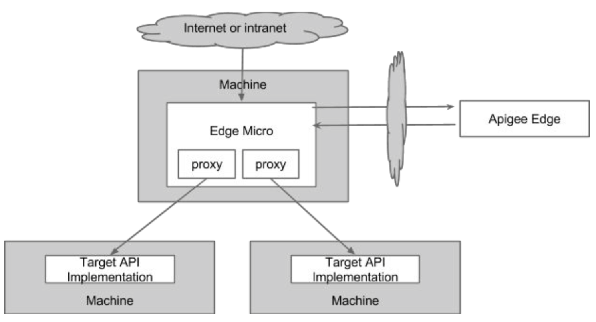
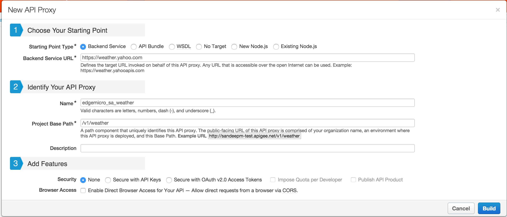

#API Services: Lesson 1 - Backend-as-a-Service

##Overview

Apigee Edge Microgateway is a secure, HTTP­based message processor for APIs. Its main job is to process requests and responses to and from backend services securely while asynchronously pushing valuable API execution data/meta data to and from Apigee Edge. 
Typically, Edge Microgateway is installed within a trusted network in close proximity to backend target services. It provides enterprise­grade security, and some key plugin features such as spike arrest, quotas etc. And leverages Edge Private/Public Cloud installation for other aspects of API Management like analytics, developer management. You can install Edge Microgateway in the same data center or even on the same machine as your backend services.



###Key features and benefits
- **Security:** Edge Microgateway authenticates requests with a signed bearer token or API key issued to each client app by Apigee Edge.
- **Rapid deployment:** Unlike a full deployment of Apigee Edge, you can deploy and run an instance of Edge Microgateway within a matter of minutes.
- **Network proximity:** You can install and manage Edge Microgateway in the same machine, subnet, or data center as the backend target APIs with which Edge Microgateway interacts.
- **Analytics:** Edge Microgateway asynchronously delivers API execution data to Apigee Edge, where it is processed by the Edge Analytics system. You can use the full suite of Edge Analytics metrics, dashboards, and APIs.
- **Reduced latency:** All communication with Apigee Edge is asynchronous and does not happen as part of processing client API requests. This allows Edge Microgateway to collect API data and send it to Apigee Edge without affecting latency.

##Objectives
In this lab you will go through configuring, get working Edge Microgateway installation capable of processing an API. You'll make several secure, test API calls through Edge Microgateway to the API's backend service and see how Apigee Edge processes analytics data from Edge Microgateway.

##Prerequisites
- [x] Edge Micro ZIP File is downloaded to local folder
- [x] Node 4.2.1 or later is installed
```
node -v
v4.2.1
```
- [x] Have access to Edge Org
- [x] The Node.js service you have created in [Lesson 6](../API%20Services%20Lesson%206%20-%20Create%20a%20Node.js%20Proxy) is up and running. This lesson uses that servics as a backend

##Estimated Time: 60 mins

###Configure Edge Micro
- Unzip the file `unzip apigee-edge-micro-1.1.0.zip`
- Go to the bin folder ```cd apigee-edge-micro-1.1.0/cli/bin```
- Test the installation by executing the following command. If it returns CLI help output, then the installation was successful.
```
./edgemicro -h
```
- Put the  cli/bin directory in your PATH variable. This way, you'll be able to execute Edge Microgateway commands from anywhere
```
export PATH=<Edge_Micro_Gateway_Installaton_Folder>/cli/bin:$PATH

echo $PATH
```

**Note:** Throughout the tutorial, we assume that the  cli/bin directory is in your  PATH. If you do not put it in your  PATH, then you need to execute CLI commands from the `cli/bin` directory.

- Configure the micro gateway to talk to the Edge deployment on public/private cloud
```
./edgemicro configure -o <org­name> -e <env­name> -u <your Apigee email>
```
- **Copy the** `Key`, `Secret` and `vault info`, for later parts of the exercise

- Verify that the edge micro is configured with the Edge Cloud org
```
./edgemicro verify -o <org­name> -e <env­name> -k <key> -s <secret>
```

###Start the Edge Micro agent
- Before continuing, open a separate terminal window. This is where the agent server will run.
- cd to the  `agent` directory.
```
cd ../../agent
```
- Execute this command to start the server:
```
npm start
	edge micro agent listening on 9000
```

The configuration done so far allows Edge Microgateway to bootstrap itself to Apigee Edge. The Edge Microgateway agent manages this bootstrapping process, which kicks off whenever you start or restart Edge Microgateway. After the bootstrapping succeeds, Edge Microgateway retrieves a payload of additional configuration information from Apigee Edge.

###Create a passthrough API Proxy
Log in to your organization on Apigee Edge.
- Select `APIs` > `API Proxies` from the top menu.
- In the API Proxies page, click `+ API Proxy`. 
- In the dialog, configure the proxy as follows:

	
 - Starting Point Type: **Backend Service**
 - Backend Service URL: **https://weather.yahoo.com**
 - Name: edgemicro_{your_initials}_weather
 - Project Base Path: /v1/weather
 - Description: Edge Micro Proxy that will run locally to the node.js service
 - Features: None

**Note:** Edge Microgateway­aware proxy names must always begin with the prefix **edgemicro_**.

- Click on `Build` to build and deploy the proxy
- Once the proxy has been deployed, click on the `Close` button
- Update target endpoint
  - Switch to the `Develop` tab of the API Proxy
  - From the `Navigator` pane, select `Target Endpoints → Default
  - In the `code` view, update the `HTTPTargetConnection` → `URL` to `http://localhost:7000` 
  
- Click on the `Save` button to save and deploy the changes to the `hotels` API Proxy
- We have created an API Proxy that will be fetched by Edge Micro gateway, when it starts locally
- Add the API Proxy you created `edgemicro_<your initials>_weather` to the API Product `<your initials> Hospitality Basic Product`
	- From the Apigee Edge Management UI, go to `Publish` → `API Products`
	- Select the API Product: `<your initials> Hospitality Basic Product`
	- Click on `Edit` Button on the top right
	- Click on `+ API Proxy` button and API Proxy `edgemicro_<your initials>_weather`
	

###Start Edge Microgateway
- Open a new terminal window (not the one where the agent is running) and print out help info for the  agentproc command. We're going to use the -c, -k, and -s options to start Edge Microgateway.
```
edgemicro agent proc -h
```
**Note:** The tutorial assumes that the cli/bin directory is in your  PATH. If you do not put it in your  PATH, then you need to execute CLI commands from the `cli/bin` directory (`cd ../cli/bin` and run `./edgemicro agent proc -h`).

- Start Edge Microgateway by executing the following command, substituting the key and secretvalues in the -k and -s parameters.

```
edgemicro agent proc -c start -k <key> -s <secret>
```

- If the micro gateway is started successfully, you will see the following console output

```json
{
    "pid": 9104,
    "uid": "MTQ0NzQ1MjU4Nzk0MQ",
    "running": "true",
    "restarts": 0,
    "since": "2015-11-13T22: 09: 47.959Z"
}
```
**Note:** The **UID** is the unique id for this instance of Edge Microgateway. You use this ID when retrieving log and monitoring information about Edge Microgateway. See the *Edge Microgateway Administrator*'s Guide for more information.

**Agent output:** In the terminal where the agent is running, you'll see output like this. You may have to scroll up through the terminal output to see some of the messages.
```
info: config download from https://edgemicroservices-us-east-1.apigee.net/edgemicro/bootstrap/organization/amer-partner1/environment/test returned 200 OK 
info: products download from https://amer-partner1-test.apigee.net/edgemicro-auth/products returned 200 OK 
info: jwt_public_key download from https://amer-partner1-test.apigee.net/edgemicro-auth/publicKey returned 200 OK 
warning: no edge micro proxies found in org
warning: no products found in org
downloaded jwt_public_key '*****'
installed plugin from /Users/SandeepM/Apigee/Products/EdgeMicro/apigee-edge-micro-1.1.0/plugins/analytics
installed plugin from /Users/SandeepM/Apigee/Products/EdgeMicro/apigee-edge-micro-1.1.0/plugins/oauth
MTQ0NzQ0NjgwNzkxOQ edge micro listening on port 8000
```
At this point, the agent retrieves a payload of Edge Microgateway configuration information from Apigee Edge. This information includes:
- [x] The public key we created and stored previously in the Apigee vault.
- [x] A JSON representation of all Edge Microgateway­aware proxies that exist in the organization/environment. These are all proxies that are named with the prefix edgemicro_. 
- [x] A JSON representation of all of the API products that exist in the organization.

With this information, Edge Microgateway knows which proxies and proxy paths are allowed. If/when configured, it uses the product information to enforce security (in the same way as any API proxy does on Apigee Edge, where developer app keys have an association with products). We'll go through the steps to secure Edge Microgateway shortly.

- To test our API Proxy, call the 

```
curl -i http://localhost:8000/v1/weather/forecastrss?w=12797282
```

- If you will see an authorization error, your Micro Gateway is listening for the API you have configured in the previous step
```
{"error":"missing_authorization","error_description":"Missing Authorization header"}
```

- Run the following command to get the JWT Token
```
curl -i -X POST "http://<org name>-test.apigee.net/edgemicro-auth/token" -H "Content-Type:application/json" -d '{"grant_type": "client_credentials", "client_id":"<client_id>", "client_secret": "<client_secret"}'
```

- Make the API Call with a bearer token you received in the step above

```
curl -i -H "Authorization:Bearer <JWT Token>" http://localhost:8000/v1/weather/forecast?zipcode=95113
```

- You should see the response json
```json
{
    "location": {
        "city": "San Jose",
        "country": "US",
        "region": "CA"
    },
    "units": {
        "distance": "mi",
        "pressure": "in",
        "speed": "mph",
        "temperature": "F"
    },
    "condition": {
        "code": "34",
        "date": "Fri, 13 Nov 2015 12:53 pm PST",
        "temp": "63",
        "text": "Fair"
    },
    "forecast": [
        {
            "code": "32",
            "date": "13 Nov 2015",
            "day": "Fri",
            "high": "66",
            "low": "44",
            "text": "Sunny"
        },
        {
            "code": "32",
            "date": "14 Nov 2015",
            "day": "Sat",
            "high": "69",
            "low": "49",
            "text": "Sunny"
        },
        {
            "code": "30",
            "date": "15 Nov 2015",
            "day": "Sun",
            "high": "58",
            "low": "40",
            "text": "AM Clouds/PM Sun"
        },
        {
            "code": "32",
            "date": "16 Nov 2015",
            "day": "Mon",
            "high": "61",
            "low": "43",
            "text": "Sunny"
        },
        {
            "code": "30",
            "date": "17 Nov 2015",
            "day": "Tue",
            "high": "66",
            "low": "44",
            "text": "AM Clouds/PM Sun"
        }
    ]
}
```

You have used the credentials you received from your Edge org on cloud and you have used them on your local Micro Gateway. You are able to manage your APIs centrally, while the enforcement is happening locally.

##Summary
That completes this hands-on lesson. In this lesson you learned about setting up an Edge Micro Gateway, creating an API Proxy and corresponding life cycle on your Edge org. You now have a fully functioning and secure Edge Microgateway that can run your APIs locally, picking up the security credentials from your Edge org.
